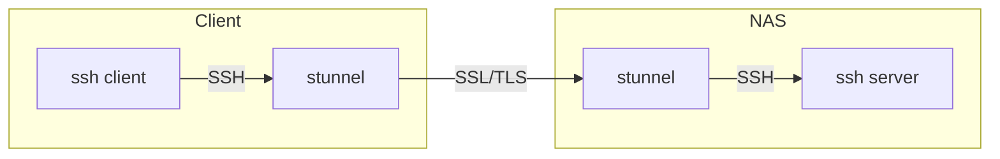

# SSH

## How to tunnel SSH over SSL/TLS

The following is needed when you are unable to connect to your NAS via SSH directly, e.g. **zscaler** that blocks port 22.



### NAS

- Install [stunnel](https://synocommunity.com/package/stunnel) SynoCommunity package
- In the folder `/var/packages/stunnel/target/etc/stunnel`
  - Create a file `stunnel.conf` with the following content:
    ```
    [ssh]
    accept = 0.0.0.0:443
    connect = 127.0.0.1:22
    cert = /etc/stunnel/stunnel.pem
    key = /etc/stunnel/stunnel.key
    ```
  - Create a self-signed certificate:
    ```bash
    openssl req -new -x509 -days 3650 -nodes -out stunnel.pem -keyout stunnel.key -newkey rsa:2048
    cat stunnel.key >> stunnel.pem
    chmod 600 stunnel.key
    ```
  - Ensure all files are owned by `sc-stunnel:sc-stunnel`
  - Control Panel > Task Scheduler > Create > Scheduled Task > **User-defined script**
    - General -> Name: `stunnel`
    - General -> User: `root`
    - General -> Event: `Boot-up`
    - Task Settings -> User-defined script: `/usr/local/bin/stunnel`

### Windows Client

- Install [stunnel](https://www.stunnel.org/) WinGet package
  ```bash
  winget install stunnel
  ```
- Create a file `stunnel.conf` with the following content:
  ```
  client = yes
  [ssh]
  accept = 5022
  connect = <NAS_IP>:443
  ```
- Run stunnel on startup, e.g. `stunnel.exe -quiet` on `HKEY_CURRENT_USER\Software\Microsoft\Windows\CurrentVersion\Run` registry key 
- Enjoy by connecting with `ssh -p 5022 localhost`

## How to sign with RSA key pairs

See [How do I sign in to DSM with RSA key pairs via SSH?](https://kb.synology.com/en-uk/DSM/tutorial/How_to_log_in_to_DSM_with_key_pairs_as_admin_or_root_permission_via_SSH_on_computers)
